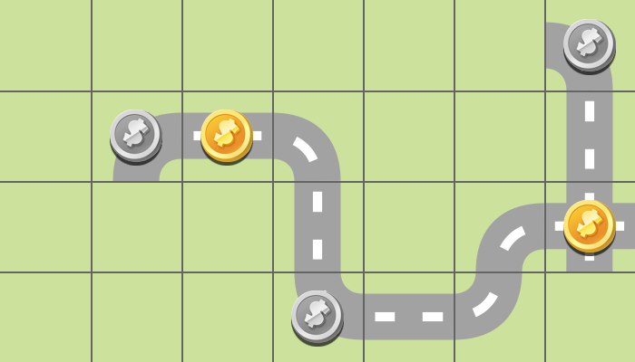
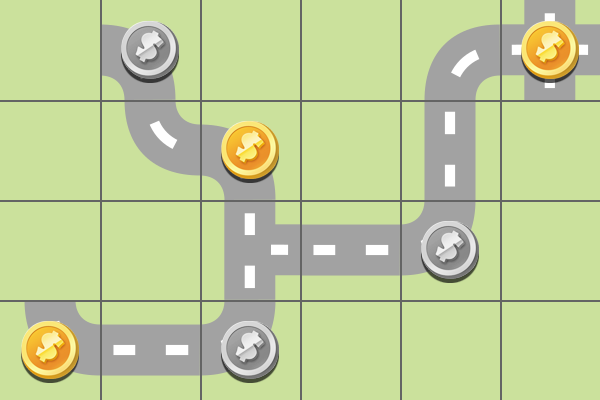

# Planning & Reasoning - Project

## Domain

## Tests

We generated five instances of problems, and we tested them using three different heuristics. 
In particular, we used:
- **A\*** (without reopening) search algorithm with the **hmax** heuristic
- **A\*** (without reopening) search algorithm with the **ff** heuristic
- **Greedy** (without reopening) search algorithm with the **ff** heuristic
- **A\*** (with reopening) search algorithm with the **lmcut** heuristic

#### Generating the problems

The instances have been generated using the script [problemGenerator.py](Script_python/problemGenerator.py), that uses the class *Problem* defined inside [Problem.py](Script_python/Problem.py). 

Usage: 
  
    cd Planning-and-Reasoning/
    python Script_python/problemGenerator.py

#### Drawing the plans

The plans obtained have then been drawn using the script [planDrawer.py](Script_python/planDrawer.py). 
In order to draw the plans, a folder with the same name of the problem must exist inside "Script_python/", and it must contain:
- the file *\<problem name\>.txt* generated by the problem generator
- the plan file generated by Fast Downward

Usage: 
  
    cd Planning-and-Reasoning/
    python Script_python/planDrawer.py <name of the problem> <name of the plan file>

### Problem 1

  
    Grid: 5x5
    Tiles: 14
    Golds: 3
    Silvers: 3

[Problem 1 - More info](Script_python/problem1/README.md)

### Problem 2

    Grid: 4x7
    Tiles: 17
    Golds: 2
    Silvers: 3

[Problem 2 - More info](Script_python/problem2/README.md)

### Problem 3

    Grid: 4x5
    Tiles: 16
    Golds: 2
    Silvers: 3

[Problem 3 - More info](Script_python/problem3/README.md)

### Problem 4

    Grid: 9x3
    Tiles: 17
    Golds: 3
    Silvers: 3

[Problem 4 - More info](Script_python/problem4/README.md)

### Problem 5

    Grid: 4x6
    Tiles: 19
    Golds: 3
    Silvers: 3

[Problem 5 - More info](Script_python/problem5/README.md)

