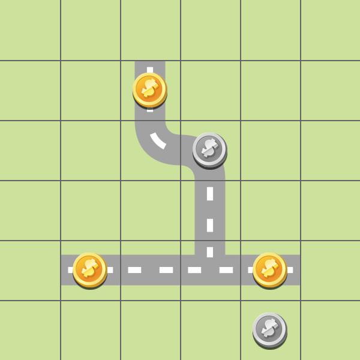
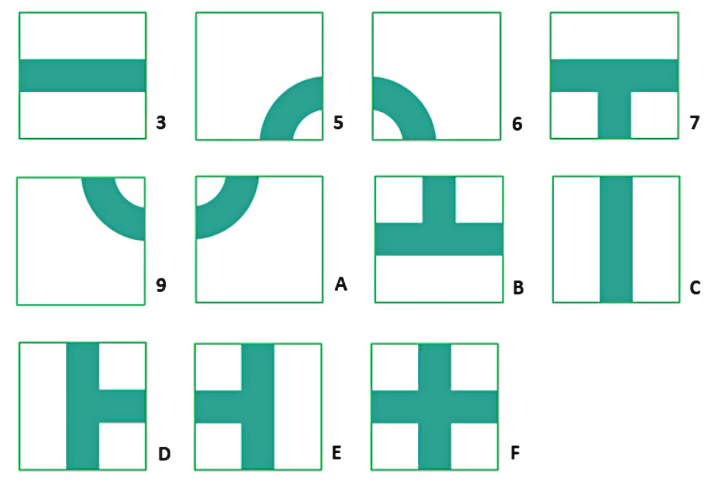

# Planning & Reasoning - Project

## Domain

The domain consists in a field divided in cells (a grid), with some cells containing pieces of gold and pieces of silver. There are some tiles, that can be used to build a path in the field. The goal is to
connect all the pieces of gold building the path using the available tiles.

The agent starts with some "debts" (same amount as the silver pieces on the field) that can be eliminated for free by picking up silver pieces, or they can be "paid off" with a specific action. In order for a plan to be valid, all the debts must have been eliminated/paid. 

The available actions are:
- Place a tile on a cell
- Pay a debt
- Pick up a silver piece to eliminate a debt without paying

The challenge is to minimize the cost, by taking the pieces of silver trying to not spend too much doing the various actions. Each tile has a different cost to be placed.

| Tile to place | Cost |
|--|--|
| Tile 3, Tile C | 6 |
| Tile 5, Tile 6, Tile 9, Tile A | 2 |
| Tile 7, Tile B, Tile D, Tile E | 8 |
| Tile F | 15 |

Paying a debt costs 15.

## Planning system

We used [Fast Downward](https://github.com/aibasel/downward) as planning system.

## Tests

We generated five instances of problems, and we tested them using the planner **LAMA-2011**, and the search algorithms **A\*** and **Greedy** with three different heuristics. 
In particular, we used:
- **A\*** (without reopening) search algorithm with the **hmax** heuristic
- **A\*** (without reopening) search algorithm with the **ff** heuristic
- **Greedy** (without reopening) search algorithm with the **ff** heuristic
- **A\*** (with reopening) search algorithm with the **lmcut** heuristic

#### Generating the problems

The instances have been generated using the script [problemGenerator.py](Script_python/problemGenerator.py), that uses the class *Problem* defined inside [Problem.py](Script_python/Problem.py). 

Usage: 
  
    cd Planning-and-Reasoning/
    python Script_python/problemGenerator.py

#### Drawing the plans

The plans obtained have then been drawn using the script [planDrawer.py](Script_python/planDrawer.py). 
In order to draw the plans, a folder with the same name of the problem must exist inside "Script_python/", and it must contain:
- the file *\<problem name\>.txt* generated by the problem generator
- the plan file generated by Fast Downward

Usage: 
  
    cd Planning-and-Reasoning/
    python Script_python/planDrawer.py <name of the problem> <name of the plan file>

### Problem 1

  
    Grid: 5x5
    Tiles: 14
    Golds: 3
    Silvers: 3

[Problem 1 - More info](Script_python/problem1/README.md)

### Problem 2

    Grid: 4x7
    Tiles: 17
    Golds: 2
    Silvers: 3

[Problem 2 - More info](Script_python/problem2/README.md)

### Problem 3

    Grid: 4x5
    Tiles: 16
    Golds: 2
    Silvers: 3

[Problem 3 - More info](Script_python/problem3/README.md)

### Problem 4

    Grid: 9x3
    Tiles: 17
    Golds: 3
    Silvers: 3

[Problem 4 - More info](Script_python/problem4/README.md)

### Problem 5

    Grid: 4x6
    Tiles: 19
    Golds: 3
    Silvers: 3

[Problem 5 - More info](Script_python/problem5/README.md)

