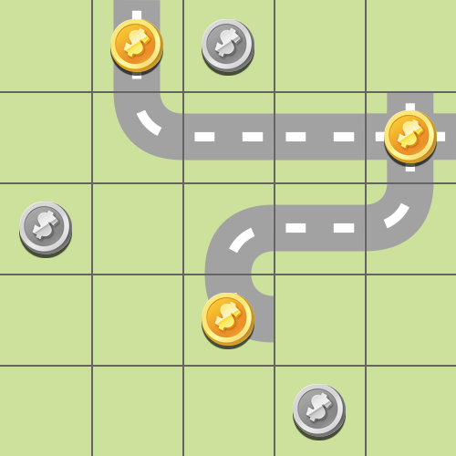
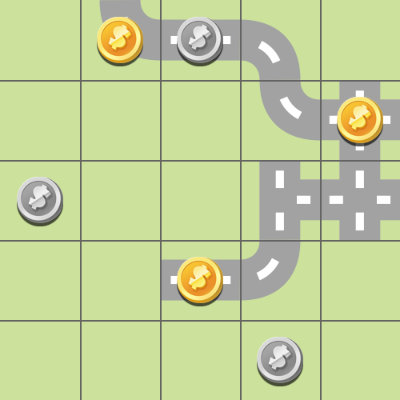

# Problem 1

### Code to generate the PDDL file

	prob = Problem("problem1", 5, 5)
	
	# tiles disponibili
	prob.setTiles3(3)
	prob.setTiles5(1)
	prob.setTiles6(2)
	prob.setTiles7(0)
	prob.setTiles9(2)
	prob.setTilesA(1)
	prob.setTilesB(0)
	prob.setTilesC(3)
	prob.setTilesD(1)
	prob.setTilesE(0)
	prob.setTilesF(1)
	
	#ori
	prob.addGold(1,4)
	prob.addGold(0,1)
	prob.addGold(3,2)
	
	# argenti
	prob.addSilver(0,2)
	prob.addSilver(2,0)
	prob.addSilver(4,3)
	
	# genera file PDDL
	prob.generateProblemFile()
	prob.generateInputForDrawing()

## LAMA

We ran **LAMA-2011** and we obtained 7 plans, of progressively smaller costs. The first and last one are shown here:

 |  
:-------------------------:|:-------------------------:
Plan 1  |  Plan 7

Information about all the generated plans:

| Plan | Search time | Plan cost |  Expanded states | Generated states |
|--|--|--|--|--|
| 1 | 0.0028903s | 77 | 14 | 260 |
| 2 | 0.00417569s | 58 | 22 | 414 |
| 3 | 0.0152153s | 54 | 162 | 1331 |
| 4 | 0.080093s | 51 | 1087 | 9174 |
| 5 | 7.13063s | 47 | 121945 | 1425665 |
| 6 | 32.6957s | 45 | 456518 | 6441427 |
| 7 | 212.855s | 44 | 3256058 | 41494474 |
| FINISH | 1352.74s | - | 13866939 | 218757904 |

| | |
|--|--|
| **Total time** | 1606.41s |
| **Peak memory** | 3205040 KB |

	run with:  --search-memory-limit 11G --alias seq-sat-lama-2011

## Other tests

### HMAX, A* (no reopening)

Plan obtained using **A\* (without reopening)** as search algorithm, and **hmax** as heuristic.

| | |
|--|--|
| **Total time** | 1400s |
| **Peak memory** | 2.5G |
| **Plan cost** | 44 |
| **Expanded states** | 14 millions |

	run with:  --search-memory-limit 11G --search "lazy_wastar([hmax()], reopen_closed=false)"

### FF, A* (no reopening)

Plan obtained using **A\* (without reopening)** as search algorithm, and **ff** as heuristic.

| | |
|--|--|
| **Total time** | 415s |
| **Peak memory** | 0.9G |
| **Plan cost** | 44 |
| **Expanded states** | 1.4 millions |

	run with:  --search-memory-limit 11G --search "lazy_wastar([ff()], reopen_closed=false)"

 
 ### FF, greedy

Plan obtained using **greedy search (without reopening)** as search algorithm, and **ff** as heuristic.

| | |
|--|--|
| **Total time** | 0.0314195s |
| **Peak memory** | 11872 KB |
| **Plan cost** | 73 |
| **Generated states** | 3797 |
	
	Expanded 510 state(s).
	Reopened 0 state(s).
	Evaluated 520 state(s).
	Evaluations: 520
	Generated 3797 state(s).
	Dead ends: 9 state(s).
	Number of registered states: 520

	run with:  --search-memory-limit 11G --search "lazy_greedy([ff()], reopen_closed=false)"

 
  ### LMCUT, A* (reopening)

Plan obtained using **A\* (with reopening)** as search algorithm, and **lmcut** as heuristic.

| | |
|--|--|
| **Total time** | 750s |
| **Peak memory** | 1G |
| **Plan cost** | 44 |
| **Expanded states** | 1.4 millions |

	run with:  --search-memory-limit 11G --search "lazy_wastar([lmcut()], reopen_closed=true)"
 
