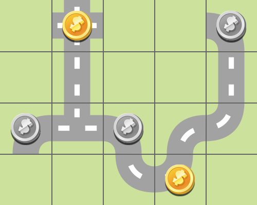

# Problem 3

### Code to generate the PDDL file

	prob = Problem("problem3", 4, 5)
	
	# tiles disponibili
	prob.setTiles3(3)
	prob.setTiles5(2)
	prob.setTiles6(2)
	prob.setTiles7(1)
	prob.setTiles9(1)
	prob.setTilesA(2)
	prob.setTilesB(1)
	prob.setTilesC(3)
	prob.setTilesD(0)
	prob.setTilesE(1)
	prob.setTilesF(0)
	
	#ori
	prob.addGold(0,1)
	prob.addGold(3,3)
	
	# argenti
	prob.addSilver(2,0)
	prob.addSilver(0,4)
	prob.addSilver(2,2)
	
	# genera file PDDL
	prob.generateProblemFile()
	prob.generateInputForDrawing()

## LAMA

We ran **LAMA-2011** and we obtained 6 plans, of progressively smaller costs. The first and last one are shown here:

 |  
:-------------------------:|:-------------------------:
Plan 1  |  Plan 6

Information about all the generated plans:

| Plan | Search time | Plan cost |  Expanded states | Generated states |
|--|--|--|--|--|
| 1 | 0.00215283s | 50 | 10 | 237 |
| 2 | 0.00305138s | 46 | 47 | 545 |
| 3 | 0.00964877s | 41 | 223 | 1935 |
| 4 | 0.015118s | 37 | 353 | 2924 |
| 5 | 0.34782s | 35 | 8512 | 88088 |
| 6 | 400.911s | 34 | 7907469 | 97330454 |
| FINISH | 677.94s | - | 7833192 | 122153293 |

| | |
|--|--|
| **Total time** | 1080.17s |
| **Peak memory** | 1846604 KB |

	run with:  --search-memory-limit 11G --alias seq-sat-lama-2011

## Other tests

### HMAX, A* (no reopening)

Plan obtained using **A\* (without reopening)** as search algorithm, and **hmax** as heuristic.

| | |
|--|--|
| **Total time** | 1850s |
| **Peak memory** | 4.4G |
| **Plan cost** | 34 |
| **Expanded states** | 14 millions |

	run with:  --search-memory-limit 11G --search "lazy_wastar([hmax()], reopen_closed=false)"

### FF, A* (no reopening)

Plan obtained using **A\* (without reopening)** as search algorithm, and **ff** as heuristic.

| | |
|--|--|
| **Total time** | 780s |
| **Peak memory** | 1.2G |
| **Plan cost** | 34 |
| **Expanded states** | 2.4 millions |

	run with:  --search-memory-limit 11G --search "lazy_wastar([ff()], reopen_closed=false)"

 
 ### FF, greedy

Plan obtained using **greedy search (without reopening)** as search algorithm, and **ff** as heuristic.

| | |
|--|--|
| **Total time** | 0.114276s |
| **Peak memory** | 11872 KB |
| **Plan cost** | 50 |
| **Generated states** | 24924 |

	Expanded 2494 state(s).
	Reopened 0 state(s).
	Evaluated 2501 state(s).
	Evaluations: 2501
	Generated 24924 state(s).
	Dead ends: 6 state(s).
	Number of registered states: 2501

	run with:  --search-memory-limit 11G --search "lazy_greedy([ff()], reopen_closed=false)"

 
  ### LMCUT, A* (reopening)

Plan obtained using **A\* (with reopening)** as search algorithm, and **lmcut** as heuristic.

| | |
|--|--|
| **Total time** | 770s |
| **Peak memory** | 1.2G |
| **Plan cost** | 34 |
| **Expanded states** | 2.5 millions |

	run with:  --search-memory-limit 11G --search "lazy_wastar([lmcut()], reopen_closed=true)"
 
